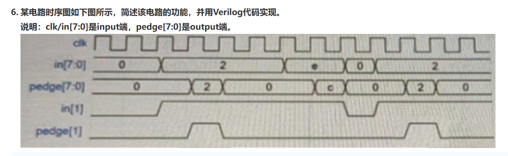
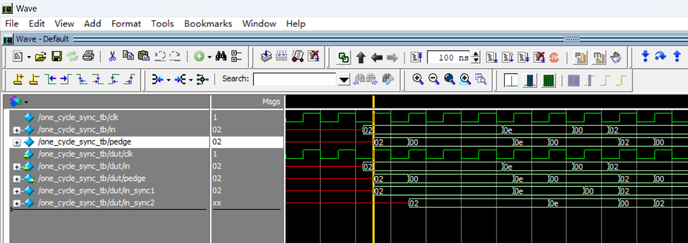

link to the problem is https://www.nowcoder.com/exam/test/80380248/detail?pid=41531964

"one_cycle_sync.v" 对应于如下题目

花了不少时间解决了，还是不太熟练，需要学习学习。

这个题目自己做错了，in 为 8'he 时对应的输出是 8'hc，并不是 8'he
功能为 
    电路功能：检测输入数据每位的上升沿。

    
"reverseString.cpp" 对应于第7题

7.C语言实现字符串反转并打印出来，例如输入“abcd”，输出“dcba”。